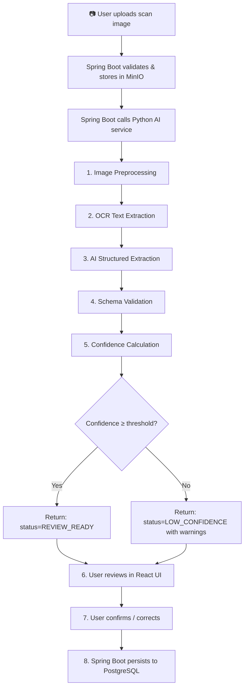
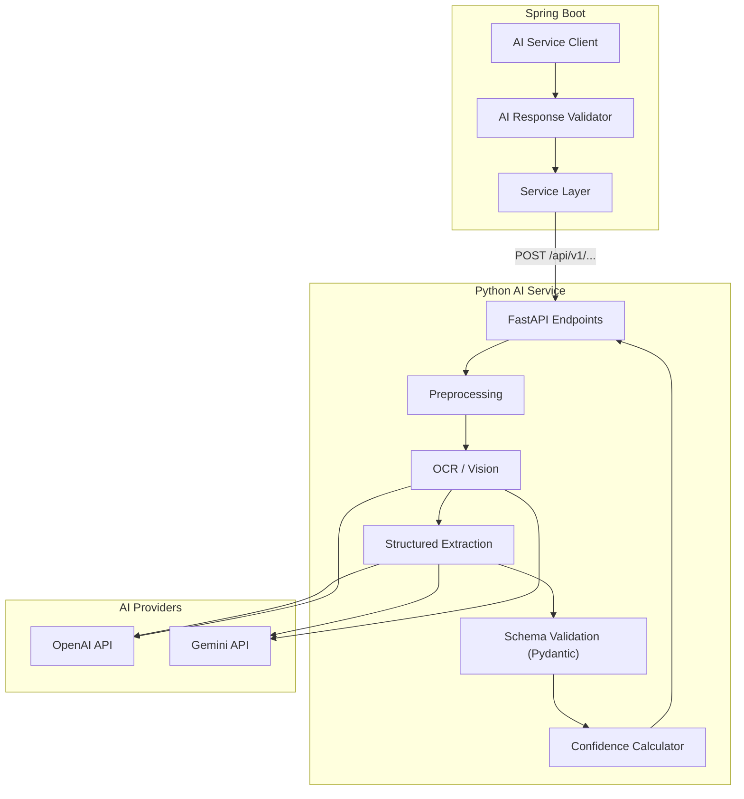

# PhysiqO-AI — AI Architecture

> **Version:** 1.0.0 · **Service:** Python FastAPI · **Status:** Design Phase

---

## 1. Core Principle

**AI is an assistant, never an authority.** Every AI-generated health measurement, nutritional estimate, or fitness recommendation must be:

1. Schema-validated against Pydantic models
2. Confidence-scored (0.0–1.0)
3. Presented to the user for review before persistence
4. Never silently persisted if confidence is below threshold

---

## 2. AIProvider Interface

```python
from typing import Protocol, Any
from pydantic import BaseModel

class StructuredResponse(BaseModel):
    data: dict[str, Any]
    confidence: float  # 0.0–1.0
    raw_response: str
    model: str
    provider: str
    processing_time_ms: int

class AIProvider(Protocol):
    """Abstract interface for AI/LLM providers."""

    async def extract_structured(
        self,
        prompt: str,
        response_schema: type[BaseModel],
        image_data: bytes | None = None,
        temperature: float = 0.1,
    ) -> StructuredResponse:
        """Extract structured data from text/image using a schema."""
        ...

    async def analyze(
        self,
        prompt: str,
        context: dict[str, Any],
        temperature: float = 0.3,
    ) -> StructuredResponse:
        """Analyze data and produce insights."""
        ...
```

### Provider Implementations

| Provider | Class | Models | Use Cases |
|---|---|---|---|
| OpenAI | `OpenAIProvider` | gpt-4o, gpt-4o-mini | OCR, analysis, estimation |
| Google | `GeminiProvider` | gemini-2.0-flash, gemini-2.0-pro | OCR, analysis, estimation |

Provider selection is configured via `AI_PROVIDER` environment variable. The system uses one active provider at a time.

### Provider Configuration

```python
class AIConfig(BaseModel):
    provider: str = "openai"  # "openai" | "gemini"
    openai_api_key: str = ""
    openai_model: str = "gpt-4o"
    gemini_api_key: str = ""
    gemini_model: str = "gemini-2.0-flash"
    max_retries: int = 2
    timeout_seconds: int = 30
```

---

## 3. OCR Pipeline

### Body Composition Extraction Pipeline

This is the most critical AI feature — extracting structured health data from scan images.



### Stage Details

#### Stage 1: Image Preprocessing

```python
class ImagePreprocessor:
    """Prepare images for optimal OCR accuracy."""

    async def preprocess(self, image_bytes: bytes) -> bytes:
        # 1. Decode image
        # 2. Auto-rotate (EXIF orientation)
        # 3. Resize if too large (max 4096px on longest side)
        # 4. Convert to RGB
        # 5. Enhance contrast (CLAHE) for scan images
        # 6. Deskew if needed
        # 7. Denoise (light gaussian blur for scans)
        return processed_bytes
```

#### Stage 2: OCR Text Extraction

```python
class OCRExtractor:
    """Extract raw text from preprocessed image."""

    async def extract_text(self, image_bytes: bytes) -> OCRResult:
        # Primary: Use AI provider's vision capability (GPT-4o / Gemini)
        # The LLM acts as both OCR and understanding layer
        # Fallback: Tesseract for simple text extraction
        return OCRResult(raw_text=text, method="vision_llm")
```

**Design decision:** We use the LLM's vision capability (GPT-4o, Gemini) as the primary OCR engine rather than traditional OCR (Tesseract). Modern vision LLMs are significantly better at understanding structured health reports. Tesseract is available as a fallback for simple text-only reports.

#### Stage 3: AI Structured Extraction

```python
class BodyCompositionExtractor:
    """Extract structured body composition data from OCR results."""

    EXTRACTION_PROMPT = """
    Extract body composition measurements from this health report image.
    Return ONLY values you can clearly read. Set confidence to 0 for any
    value you are uncertain about. Do NOT fabricate values.

    Expected measurements (extract any that are visible):
    - body_weight_kg
    - body_fat_pct
    - lean_mass_kg
    - fat_mass_kg
    - skeletal_muscle_mass_kg
    - bmi
    - bmr_kcal
    - visceral_fat_level
    - body_water_pct
    - bone_mineral_kg
    """

    async def extract(
        self,
        image_bytes: bytes,
        report_type: str,
        ai_provider: AIProvider,
    ) -> BodyCompositionExtraction:
        response = await ai_provider.extract_structured(
            prompt=self.EXTRACTION_PROMPT,
            response_schema=BodyCompositionExtraction,
            image_data=image_bytes,
            temperature=0.1,  # Low temperature for factual extraction
        )
        return self._validate_and_score(response)
```

#### Stage 4: Schema Validation

```python
class BodyCompositionMeasurement(BaseModel):
    metric_name: str
    metric_value: float
    metric_unit: str
    confidence: float = Field(ge=0.0, le=1.0)

    @field_validator("metric_name")
    @classmethod
    def validate_metric_name(cls, v: str) -> str:
        allowed = {
            "body_weight_kg", "body_fat_pct", "lean_mass_kg",
            "fat_mass_kg", "skeletal_muscle_mass_kg", "bmi",
            "bmr_kcal", "visceral_fat_level", "body_water_pct",
            "bone_mineral_kg",
        }
        if v not in allowed:
            raise ValueError(f"Unknown metric: {v}")
        return v

    @field_validator("metric_value")
    @classmethod
    def validate_reasonable_value(cls, v: float, info) -> float:
        # Sanity checks — reject clearly impossible values
        bounds = {
            "body_weight_kg": (20, 350),
            "body_fat_pct": (2, 70),
            "lean_mass_kg": (15, 200),
            "bmi": (10, 80),
            "bmr_kcal": (500, 5000),
        }
        name = info.data.get("metric_name", "")
        if name in bounds:
            lo, hi = bounds[name]
            if not (lo <= v <= hi):
                raise ValueError(f"{name} value {v} outside reasonable range [{lo}, {hi}]")
        return v


class BodyCompositionExtraction(BaseModel):
    measurements: list[BodyCompositionMeasurement]
    overall_confidence: float = Field(ge=0.0, le=1.0)
    raw_text: str
    processing_time_ms: int
```

#### Stage 5: Confidence Calculation

```python
class ConfidenceCalculator:
    # Thresholds
    HIGH_CONFIDENCE = 0.85    # Auto-acceptable (still shown for review)
    MEDIUM_CONFIDENCE = 0.60  # Show with warnings
    LOW_CONFIDENCE = 0.40     # Show with strong warnings
    REJECT_THRESHOLD = 0.20   # Reject extraction, suggest manual entry

    def calculate_overall(self, measurements: list[BodyCompositionMeasurement]) -> float:
        if not measurements:
            return 0.0
        # Weighted average — critical metrics weighted higher
        weights = {
            "body_weight_kg": 2.0,
            "body_fat_pct": 2.0,
            "lean_mass_kg": 1.5,
            "skeletal_muscle_mass_kg": 1.5,
        }
        total_weight = 0
        weighted_sum = 0
        for m in measurements:
            w = weights.get(m.metric_name, 1.0)
            weighted_sum += m.confidence * w
            total_weight += w
        return round(weighted_sum / total_weight, 3)

    def classify(self, confidence: float) -> str:
        if confidence >= self.HIGH_CONFIDENCE:
            return "HIGH"
        elif confidence >= self.MEDIUM_CONFIDENCE:
            return "MEDIUM"
        elif confidence >= self.LOW_CONFIDENCE:
            return "LOW"
        else:
            return "REJECTED"
```

---

## 4. Progress Analysis

```python
class ProgressAnalyzer:
    """Analyze user's progress over a date range."""

    ANALYSIS_PROMPT = """
    Analyze the following fitness data for trends and provide actionable insights.
    Be factual. Do NOT make claims that aren't supported by the data.
    If the data is insufficient, say so explicitly.
    """

    async def analyze(
        self,
        user_data: UserProgressData,
        ai_provider: AIProvider,
    ) -> ProgressAnalysis:
        context = {
            "body_composition": [m.model_dump() for m in user_data.body_comp],
            "workouts": [w.model_dump() for w in user_data.workouts],
            "nutrition": [n.model_dump() for n in user_data.nutrition],
            "date_range": {"from": str(user_data.from_date), "to": str(user_data.to_date)},
        }
        response = await ai_provider.analyze(
            prompt=self.ANALYSIS_PROMPT,
            context=context,
            temperature=0.3,
        )
        return ProgressAnalysis.model_validate(response.data)
```

### Response Schema

```python
class Insight(BaseModel):
    category: str  # BODY_COMP, WORKOUT, NUTRITION
    title: str
    description: str
    confidence: float = Field(ge=0.0, le=1.0)

class Recommendation(BaseModel):
    category: str
    priority: str  # HIGH, MEDIUM, LOW
    suggestion: str

class ProgressAnalysis(BaseModel):
    summary: str
    insights: list[Insight]
    recommendations: list[Recommendation]
    data_quality_note: str | None = None  # Warning if insufficient data
```

---

## 5. Workout Analysis

```python
class WorkoutAnalyzer:
    """Analyze a workout session for volume, balance, and suggestions."""

    async def analyze(
        self,
        session_data: WorkoutSessionData,
        ai_provider: AIProvider,
    ) -> WorkoutAnalysis:
        # Compute volume metrics deterministically (no AI needed)
        volume = self._compute_volume(session_data)
        muscle_dist = self._compute_muscle_distribution(session_data)

        # Use AI only for qualitative suggestions
        suggestions = await self._get_suggestions(
            session_data, volume, muscle_dist, ai_provider
        )

        return WorkoutAnalysis(
            volume_analysis=volume,
            muscle_distribution=muscle_dist,
            suggestions=suggestions,
            confidence=0.9,  # High — mostly deterministic
        )
```

**Design note:** Volume calculations (total sets, reps, tonnage) are computed deterministically in code, not by AI. AI is only used for qualitative suggestions. This ensures numeric accuracy.

---

## 6. Meal Estimation

```python
class MealEstimator:
    """Estimate nutritional content from a meal photo."""

    ESTIMATION_PROMPT = """
    Identify foods in this meal photo and estimate nutritional content.
    For each item, estimate:
    - name, approximate serving size in grams
    - calories, protein, carbs, fat

    Be conservative in estimates. Include a confidence score.
    State clearly that these are ESTIMATES and should be verified.
    """

    async def estimate(
        self,
        image_bytes: bytes,
        ai_provider: AIProvider,
    ) -> MealEstimation:
        response = await ai_provider.extract_structured(
            prompt=self.ESTIMATION_PROMPT,
            response_schema=MealEstimation,
            image_data=image_bytes,
            temperature=0.2,
        )
        # Always include disclaimer
        estimation = MealEstimation.model_validate(response.data)
        estimation.disclaimer = (
            "These nutritional values are AI estimates based on visual analysis. "
            "Actual values may vary significantly. For accurate tracking, "
            "please verify against food labels or a nutrition database."
        )
        return estimation
```

---

## 7. Diet Planning

```python
class DietPlanner:
    """Generate diet plan suggestions based on nutritional targets."""

    async def suggest(
        self,
        targets: NutritionTargets,
        preferences: list[str],
        ai_provider: AIProvider,
    ) -> DietPlan:
        response = await ai_provider.analyze(
            prompt=self.PLANNING_PROMPT,
            context={
                "targets": targets.model_dump(),
                "preferences": preferences,
            },
            temperature=0.5,  # Slightly higher for creative suggestions
        )
        plan = DietPlan.model_validate(response.data)
        plan.disclaimer = (
            "This diet plan is an AI-generated suggestion. "
            "Consult a registered dietitian for personalized nutrition advice."
        )
        return plan
```

---

## 8. Confidence Handling Strategy

### Per-Feature Confidence Thresholds

| Feature | High | Medium | Low | Reject |
|---|---|---|---|---|
| Body composition OCR | ≥ 0.85 | ≥ 0.60 | ≥ 0.40 | < 0.40 |
| Meal estimation | ≥ 0.75 | ≥ 0.50 | ≥ 0.30 | < 0.30 |
| Progress analysis | ≥ 0.70 | ≥ 0.50 | — | — |
| Diet suggestions | N/A | N/A | N/A | N/A |

### Confidence Rules

1. **Body composition OCR:**
   - HIGH → Show to user with green indicator, pre-fill form
   - MEDIUM → Show with yellow warning, pre-fill form but highlight uncertain fields
   - LOW → Show with red warning, suggest manual entry
   - REJECTED → Do not pre-fill, ask user to enter manually

2. **Meal estimation:**
   - Always clearly labeled as "Estimate"
   - Never auto-logged — user must confirm

3. **Progress analysis / Diet planning:**
   - Advisory only — no persistence decision depends on confidence
   - Include `data_quality_note` if input data seems insufficient

### Safety Rules

```
NEVER:
  ✗ Auto-persist uncertain health measurements
  ✗ Fabricate values for missing fields
  ✗ Present estimates as facts
  ✗ Make medical diagnoses or treatment suggestions
  ✗ Fabricate product verification or pricing data

ALWAYS:
  ✓ Return confidence scores with every extraction
  ✓ Include disclaimers on AI-generated content
  ✓ Allow user to override/correct every AI output
  ✓ Log raw AI responses for audit
  ✓ Validate against reasonable value ranges
  ✓ Degrade gracefully when AI is unavailable
```

---

## 9. Error Handling in AI Pipeline

```python
class AIServiceError(Exception):
    """Base exception for AI service errors."""
    pass

class AIProviderError(AIServiceError):
    """Error communicating with AI provider (OpenAI, Gemini)."""
    pass

class AIExtractionError(AIServiceError):
    """AI returned data that failed validation."""
    pass

class AIRateLimitError(AIServiceError):
    """AI provider rate limit hit."""
    pass
```

### Retry Strategy

| Error Type | Retry? | Max Retries | Backoff |
|---|---|---|---|
| Network timeout | Yes | 2 | Exponential (1s, 3s) |
| Rate limit (429) | Yes | 2 | Use Retry-After header |
| Validation failure | No | — | Return error to Spring Boot |
| Provider error (500) | Yes | 1 | 2s |
| Invalid image | No | — | Return error |

---

## 10. AI Audit Trail

Every AI interaction is logged:

```python
class AIAuditLog(BaseModel):
    request_id: str        # X-Request-Id from Spring Boot
    endpoint: str          # Which pipeline was used
    provider: str          # openai / gemini
    model: str             # gpt-4o / gemini-2.0-flash
    input_type: str        # image / text / mixed
    input_size_bytes: int
    output_data: dict      # Structured response
    raw_response: str      # Raw LLM output
    confidence: float
    processing_time_ms: int
    error: str | None
    timestamp: str         # ISO 8601
```

Audit logs are written to the Python service's log output (structured JSON). Spring Boot stores the `ai_raw_response` in the `body_composition_reports` table for user-facing data.

---

## 11. Architecture Diagram


