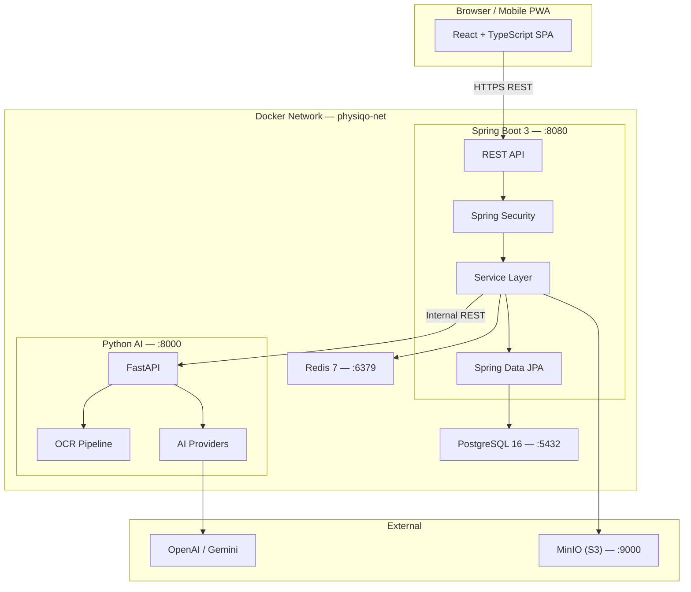
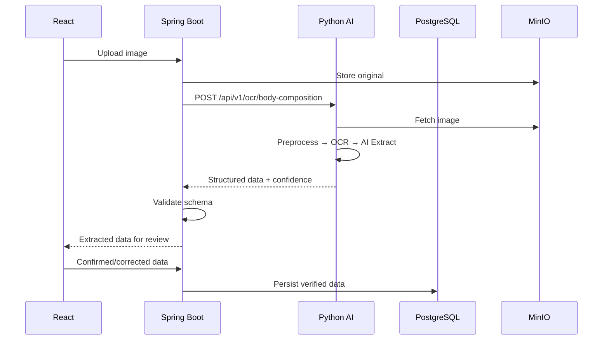
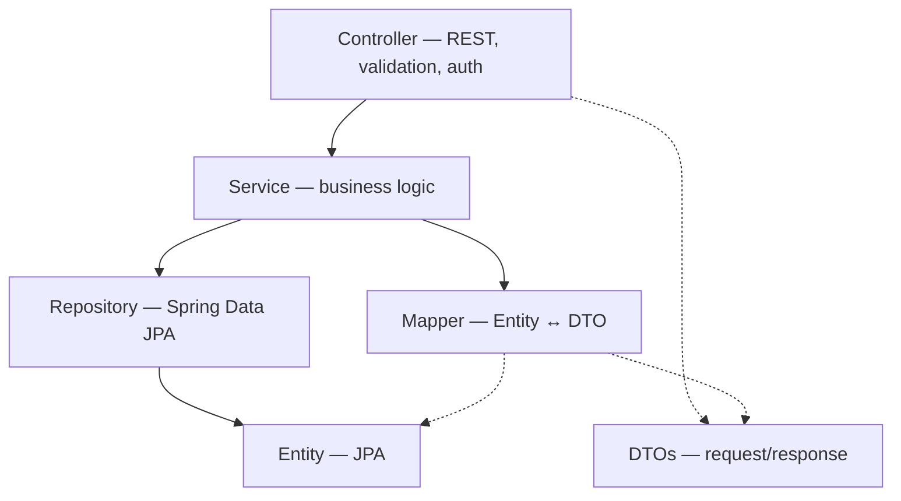
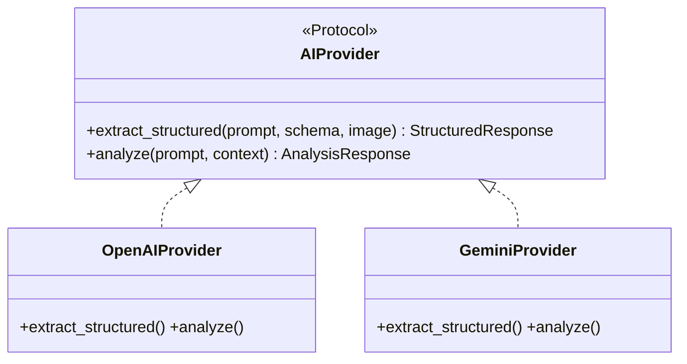

# PhysiqO-AI — System Architecture

> **Version:** 1.0.0 · **Status:** Design Phase · **Last Updated:** 2026-07-19

---

## 1. System Overview

PhysiqO-AI is a modular monolith with a single companion AI/OCR microservice. It helps users track body composition, plan workouts, manage nutrition, and discover protein & supplement products — augmented by AI-driven insights.

### Design Principles

1. **Simplicity** — one developer can run, debug, and deploy the entire system.
2. **Spring Boot is the system of record** — all application data lives in PostgreSQL, owned by Spring Boot.
3. **Python handles AI/OCR only** — never writes directly to the application database.
4. **React is a presentation layer** — zero business logic in the frontend.
5. **Metric internally** — all measurements stored in kg/cm/ml; conversion at API boundary.

---

## 2. High-Level Architecture



---

## 3. Service Boundaries & Data Ownership

| Concern | Owner | Notes |
|---|---|---|
| User management | Spring Boot | Registration, auth, profiles |
| Body composition | Spring Boot | CRUD, history, trends |
| Workouts | Spring Boot | Plans, sessions, progress |
| Nutrition | Spring Boot | Meals, goals, tracking |
| Products | Spring Boot | Catalog, prices, alerts |
| OCR extraction | Python AI | Image → structured data |
| AI insights | Python AI | Analysis, recommendations |
| File storage | MinIO via Spring Boot | S3-compatible object store |
| Caching | Redis | Sessions, rate limits, cache |

### Critical Data Flow: AI-Assisted Extraction



> **Rule:** Python AI NEVER writes to PostgreSQL. It returns structured responses; Spring Boot validates and persists.

---

## 4. Frontend Architecture

**Stack:** React 18 · TypeScript 5 · Vite 5 · Tailwind CSS 3 · TanStack Query v5 · React Router v6 · Zustand · React Hook Form + Zod · Recharts · Axios

```
frontend/
├── src/
│   ├── api/                  # Axios instance + endpoint modules
│   ├── components/
│   │   ├── ui/               # Button, Input, Card, Modal
│   │   ├── layout/           # Shell, Sidebar, Navbar
│   │   └── charts/           # Recharts wrappers
│   ├── features/             # Feature modules (co-located)
│   │   ├── auth/             # components/ hooks/ pages/ types.ts
│   │   ├── dashboard/
│   │   ├── body-composition/
│   │   ├── workouts/
│   │   ├── nutrition/
│   │   └── products/
│   ├── hooks/                # Global hooks
│   ├── lib/                  # units.ts, validation.ts, constants
│   ├── stores/               # Zustand (theme, UI state)
│   ├── types/                # Shared TS types
│   ├── App.tsx
│   └── routes.tsx
├── tailwind.config.ts
└── vite.config.ts
```

**Key patterns:** TanStack Query for all server state · feature co-location · unit conversion at display boundary · optimistic mutations.

---

## 5. Spring Boot Architecture

### Module Structure (Modular Monolith)

```
backend/src/main/java/com/physiqo/
├── PhysiqoApplication.java
├── common/
│   ├── config/         # SecurityConfig, CorsConfig, RedisConfig, etc.
│   ├── exception/      # GlobalExceptionHandler, ApiException, ErrorCode
│   ├── security/       # JwtTokenProvider, JwtAuthFilter, @CurrentUser
│   ├── storage/        # StorageService interface, MinioStorageService
│   ├── audit/          # AuditableEntity (createdAt, updatedAt)
│   └── util/           # UnitConverter
├── auth/               # controller/ dto/ service/
├── user/               # controller/ dto/ entity/ mapper/ service/ repository/
├── bodycomp/           # controller/ dto/ entity/ mapper/ service/ repository/
├── workout/            # controller/ dto/ entity/ mapper/ service/ repository/
├── nutrition/          # controller/ dto/ entity/ mapper/ service/ repository/
├── product/            # controller/ dto/ entity/ mapper/ service/ repository/
├── ai/                 # client/ (AiServiceClient, DTOs) service/ validation/
└── notification/       # controller/ dto/ entity/ service/ repository/
```

### Layer Architecture



**Key patterns:** DTOs at boundaries (entities never leak) · `@CurrentUser` annotation · JPA auditing · `@ControllerAdvice` global error handling · AI client via `RestClient`.

---

## 6. Python AI Service

```
ai-service/app/
├── main.py                 # FastAPI app
├── config.py               # pydantic-settings
├── api/v1/
│   ├── ocr.py              # OCR endpoints
│   ├── analysis.py         # Analysis endpoints
│   └── estimation.py       # Meal/diet estimation
├── core/
│   ├── ai_provider.py      # AIProvider Protocol
│   ├── openai_provider.py
│   ├── gemini_provider.py
│   └── confidence.py       # Confidence scoring
├── pipelines/
│   ├── ocr/                # preprocessor, extractor, body_comp
│   ├── analysis/           # progress, workout
│   └── nutrition/          # meal_estimator, diet_planner
├── schemas/                # Pydantic models
└── utils/                  # image.py, storage.py
```



---

## 7. Communication

| Direction | Protocol | Auth |
|---|---|---|
| React → Spring Boot | HTTPS REST | JWT Bearer |
| Spring Boot → Python AI | HTTP REST (internal network) | `X-Service-Key` header |
| Spring Boot → PostgreSQL | JDBC | Credentials |
| Spring Boot → Redis | Redis protocol | Password |
| Spring Boot → MinIO | S3 API | Access key/secret |
| Python AI → MinIO | S3 API (read-only) | Access key/secret |
| Python AI → LLM APIs | HTTPS | API key |

---

## 8. File Storage

- **MinIO** — S3-compatible, runs in Docker.
- **Bucket:** `physiqo-uploads/{user_id}/{category}/{uuid}.{ext}`
- **Categories:** `body-composition`, `meals`, `products`, `profile`
- **Metadata** in PostgreSQL (`uploaded_files` table).
- **Access:** Spring Boot generates presigned URLs for frontend display.
- **Limit:** 10 MB per image.

---

## 9. Authentication

- **Access tokens:** JWT, HS256, 15-minute expiry.
- **Refresh tokens:** Opaque, 7-day expiry, stored in Redis (revocable).
- **Password storage:** bcrypt, strength 12.
- **Transport:** Access token in `Authorization: Bearer` header; refresh token in httpOnly cookie.

---

## 10. Error Handling

All errors return a consistent shape:

```json
{
  "status": 422,
  "error": "VALIDATION_ERROR",
  "message": "Validation failed",
  "details": [{"field": "weight", "message": "must be > 0"}],
  "timestamp": "2026-07-19T01:00:00Z",
  "path": "/api/v1/body-composition/measurements"
}
```

Exception hierarchy: `ApiException` → `AuthenticationException`, `ResourceNotFoundException`, `ValidationException`, `AiServiceException`, `StorageException`, `BusinessRuleException`.

---

## 11. Logging & Observability

- **Spring Boot:** SLF4J + Logback (JSON in prod).
- **Python:** structlog (JSON in prod).
- **Correlation:** `X-Request-Id` propagated from Spring Boot → Python AI; included in all log entries via MDC / context vars.

---

## 12. Configuration Management

| Profile | Purpose |
|---|---|
| `dev` | Local Docker Compose |
| `test` | Integration tests (Testcontainers) |
| `prod` | Production |

All secrets via environment variables, never in config files. Python uses `pydantic-settings` with `.env`.

---

## 13. External Integration Boundaries

Every external service is behind an interface/protocol:

| Integration | Abstraction | Owner |
|---|---|---|
| Object storage | `StorageService` interface | Spring Boot |
| AI provider | `AIProvider` Protocol | Python AI |
| Email (future) | `NotificationService` interface | Spring Boot |
| Payment (future) | `PaymentService` interface | Spring Boot |

---

## 14. Risks & Mitigations

| Risk | Mitigation |
|---|---|
| AI downtime | Graceful degradation; manual entry always available |
| LLM hallucination | Confidence scoring + mandatory user review |
| Image storage growth | Per-user quotas, compression |
| JWT secret compromise | Short-lived tokens, refresh rotation |
| DB growth | Indexes on query patterns, archival strategy |
