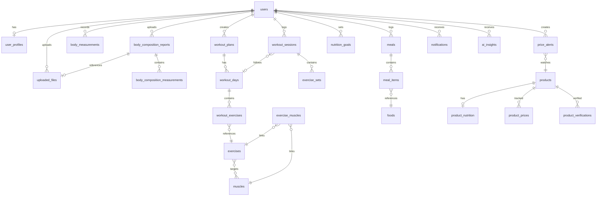

# PhysiqO-AI — Database Schema

> **Version:** 1.0.0 · **Engine:** PostgreSQL 16 · **Migrations:** Flyway

---

## Design Decisions

1. **UUIDs as primary keys** — prevents enumeration attacks, safe for distributed future.
2. **Metric units internally** — weight in kg, height/measurements in cm, volume in ml. Conversion at API layer.
3. **Soft deletes where appropriate** — `deleted_at` on user-facing data; hard delete on transient data.
4. **JPA auditing** — `created_at`, `updated_at` on all tables via `AuditableEntity`.
5. **Normalized schema** — no JSON blobs for structured data; JSON only for AI metadata/raw responses.
6. **Timestamps in UTC** — `TIMESTAMPTZ` everywhere.

---

## Entity Relationship Diagram



---

## Tables

### `users`

| Column | Type | Constraints | Notes |
|---|---|---|---|
| `id` | `UUID` | PK, DEFAULT gen_random_uuid() | |
| `email` | `VARCHAR(255)` | UNIQUE, NOT NULL | Lowercased |
| `password_hash` | `VARCHAR(255)` | NOT NULL | bcrypt |
| `email_verified` | `BOOLEAN` | NOT NULL, DEFAULT false | |
| `enabled` | `BOOLEAN` | NOT NULL, DEFAULT true | Account active |
| `role` | `VARCHAR(20)` | NOT NULL, DEFAULT 'USER' | USER, ADMIN |
| `created_at` | `TIMESTAMPTZ` | NOT NULL, DEFAULT now() | |
| `updated_at` | `TIMESTAMPTZ` | NOT NULL, DEFAULT now() | |
| `deleted_at` | `TIMESTAMPTZ` | NULL | Soft delete |

**Indexes:** `idx_users_email` UNIQUE on `email`

---

### `user_profiles`

| Column | Type | Constraints | Notes |
|---|---|---|---|
| `id` | `UUID` | PK | |
| `user_id` | `UUID` | FK → users, UNIQUE, NOT NULL | One profile per user |
| `display_name` | `VARCHAR(100)` | | |
| `date_of_birth` | `DATE` | | |
| `gender` | `VARCHAR(20)` | | MALE, FEMALE, OTHER, PREFER_NOT_TO_SAY |
| `height_cm` | `DECIMAL(5,1)` | | Stored in cm |
| `activity_level` | `VARCHAR(20)` | | SEDENTARY, LIGHT, MODERATE, ACTIVE, VERY_ACTIVE |
| `fitness_goal` | `VARCHAR(30)` | | LOSE_FAT, MAINTAIN, BUILD_MUSCLE, RECOMP |
| `unit_preference` | `VARCHAR(10)` | NOT NULL, DEFAULT 'METRIC' | METRIC, IMPERIAL |
| `avatar_file_id` | `UUID` | FK → uploaded_files, NULL | |
| `timezone` | `VARCHAR(50)` | DEFAULT 'UTC' | IANA timezone |
| `created_at` | `TIMESTAMPTZ` | NOT NULL | |
| `updated_at` | `TIMESTAMPTZ` | NOT NULL | |

**Indexes:** `idx_user_profiles_user_id` UNIQUE on `user_id`

---

### `body_composition_reports`

Represents a single body composition scan/test event (e.g., DEXA scan, InBody report).

| Column | Type | Constraints | Notes |
|---|---|---|---|
| `id` | `UUID` | PK | |
| `user_id` | `UUID` | FK → users, NOT NULL | |
| `report_date` | `DATE` | NOT NULL | Date of the scan |
| `report_type` | `VARCHAR(30)` | NOT NULL | DEXA, INBODY, BIOIMPEDANCE, MANUAL |
| `source` | `VARCHAR(20)` | NOT NULL | OCR, MANUAL |
| `file_id` | `UUID` | FK → uploaded_files, NULL | Original scan image |
| `ai_confidence` | `DECIMAL(4,3)` | NULL | 0.000–1.000, NULL if manual |
| `user_reviewed` | `BOOLEAN` | NOT NULL, DEFAULT false | Must be true before trusted |
| `ai_raw_response` | `JSONB` | NULL | Raw AI extraction for audit |
| `notes` | `TEXT` | | |
| `created_at` | `TIMESTAMPTZ` | NOT NULL | |
| `updated_at` | `TIMESTAMPTZ` | NOT NULL | |

**Indexes:** `idx_bcr_user_date` on `(user_id, report_date DESC)`

---

### `body_composition_measurements`

Individual metrics from a body composition report. One report has many measurements.

| Column | Type | Constraints | Notes |
|---|---|---|---|
| `id` | `UUID` | PK | |
| `report_id` | `UUID` | FK → body_composition_reports, NOT NULL | |
| `metric_name` | `VARCHAR(50)` | NOT NULL | body_fat_pct, lean_mass_kg, etc. |
| `metric_value` | `DECIMAL(10,3)` | NOT NULL | Metric units |
| `metric_unit` | `VARCHAR(20)` | NOT NULL | kg, pct, cm, etc. |
| `confidence` | `DECIMAL(4,3)` | NULL | Per-field confidence |
| `user_corrected` | `BOOLEAN` | NOT NULL, DEFAULT false | Did user edit this? |
| `created_at` | `TIMESTAMPTZ` | NOT NULL | |

**Indexes:** `idx_bcm_report` on `report_id` · **Unique:** `(report_id, metric_name)`

**Standard metric names:** `body_weight_kg`, `body_fat_pct`, `lean_mass_kg`, `fat_mass_kg`, `skeletal_muscle_mass_kg`, `bmi`, `bmr_kcal`, `visceral_fat_level`, `body_water_pct`, `bone_mineral_kg`

---

### `body_measurements`

Manual body tape measurements (chest, waist, arms, etc.).

| Column | Type | Constraints | Notes |
|---|---|---|---|
| `id` | `UUID` | PK | |
| `user_id` | `UUID` | FK → users, NOT NULL | |
| `measured_at` | `TIMESTAMPTZ` | NOT NULL | |
| `weight_kg` | `DECIMAL(5,2)` | NULL | |
| `neck_cm` | `DECIMAL(5,1)` | NULL | |
| `chest_cm` | `DECIMAL(5,1)` | NULL | |
| `waist_cm` | `DECIMAL(5,1)` | NULL | |
| `hips_cm` | `DECIMAL(5,1)` | NULL | |
| `left_bicep_cm` | `DECIMAL(5,1)` | NULL | |
| `right_bicep_cm` | `DECIMAL(5,1)` | NULL | |
| `left_forearm_cm` | `DECIMAL(5,1)` | NULL | |
| `right_forearm_cm` | `DECIMAL(5,1)` | NULL | |
| `left_thigh_cm` | `DECIMAL(5,1)` | NULL | |
| `right_thigh_cm` | `DECIMAL(5,1)` | NULL | |
| `left_calf_cm` | `DECIMAL(5,1)` | NULL | |
| `right_calf_cm` | `DECIMAL(5,1)` | NULL | |
| `notes` | `TEXT` | | |
| `created_at` | `TIMESTAMPTZ` | NOT NULL | |
| `updated_at` | `TIMESTAMPTZ` | NOT NULL | |

**Indexes:** `idx_bm_user_date` on `(user_id, measured_at DESC)`

**Design note:** Individual columns (not EAV) because the set of measurements is fixed and this enables type-safe queries and proper constraints.

---

### `muscles`

Reference table of muscles.

| Column | Type | Constraints | Notes |
|---|---|---|---|
| `id` | `UUID` | PK | |
| `name` | `VARCHAR(50)` | UNIQUE, NOT NULL | e.g., "Pectoralis Major" |
| `muscle_group` | `VARCHAR(30)` | NOT NULL | CHEST, BACK, SHOULDERS, ARMS, CORE, LEGS |
| `description` | `TEXT` | | |

**Seeded via migration.**

---

### `exercises`

| Column | Type | Constraints | Notes |
|---|---|---|---|
| `id` | `UUID` | PK | |
| `name` | `VARCHAR(100)` | NOT NULL | |
| `description` | `TEXT` | | |
| `category` | `VARCHAR(30)` | NOT NULL | COMPOUND, ISOLATION, CARDIO, FLEXIBILITY |
| `equipment` | `VARCHAR(30)` | | BARBELL, DUMBBELL, MACHINE, CABLE, BODYWEIGHT, BAND |
| `difficulty` | `VARCHAR(15)` | | BEGINNER, INTERMEDIATE, ADVANCED |
| `instructions` | `TEXT` | | |
| `is_custom` | `BOOLEAN` | NOT NULL, DEFAULT false | User-created? |
| `created_by` | `UUID` | FK → users, NULL | NULL = system exercise |
| `created_at` | `TIMESTAMPTZ` | NOT NULL | |
| `updated_at` | `TIMESTAMPTZ` | NOT NULL | |

**Indexes:** `idx_exercises_category` on `category` · `idx_exercises_created_by` on `created_by`

---

### `exercise_muscles`

Join table: which muscles an exercise targets.

| Column | Type | Constraints | Notes |
|---|---|---|---|
| `exercise_id` | `UUID` | FK → exercises, NOT NULL | |
| `muscle_id` | `UUID` | FK → muscles, NOT NULL | |
| `involvement` | `VARCHAR(15)` | NOT NULL | PRIMARY, SECONDARY, STABILIZER |

**PK:** `(exercise_id, muscle_id)` · **Indexes:** `idx_em_muscle` on `muscle_id`

---

### `workout_plans`

| Column | Type | Constraints | Notes |
|---|---|---|---|
| `id` | `UUID` | PK | |
| `user_id` | `UUID` | FK → users, NOT NULL | |
| `name` | `VARCHAR(100)` | NOT NULL | |
| `description` | `TEXT` | | |
| `goal` | `VARCHAR(30)` | | STRENGTH, HYPERTROPHY, ENDURANCE, GENERAL |
| `difficulty` | `VARCHAR(15)` | | BEGINNER, INTERMEDIATE, ADVANCED |
| `is_active` | `BOOLEAN` | NOT NULL, DEFAULT true | Currently followed? |
| `created_at` | `TIMESTAMPTZ` | NOT NULL | |
| `updated_at` | `TIMESTAMPTZ` | NOT NULL | |

**Indexes:** `idx_wp_user` on `user_id`

---

### `workout_days`

| Column | Type | Constraints | Notes |
|---|---|---|---|
| `id` | `UUID` | PK | |
| `plan_id` | `UUID` | FK → workout_plans, NOT NULL, ON DELETE CASCADE | |
| `day_number` | `SMALLINT` | NOT NULL | 1-based order |
| `name` | `VARCHAR(50)` | NOT NULL | e.g., "Push Day", "Upper Body" |
| `notes` | `TEXT` | | |

**Unique:** `(plan_id, day_number)` · **Indexes:** `idx_wd_plan` on `plan_id`

---

### `workout_exercises`

Prescribed exercises within a workout day.

| Column | Type | Constraints | Notes |
|---|---|---|---|
| `id` | `UUID` | PK | |
| `day_id` | `UUID` | FK → workout_days, NOT NULL, ON DELETE CASCADE | |
| `exercise_id` | `UUID` | FK → exercises, NOT NULL | |
| `order_index` | `SMALLINT` | NOT NULL | Display/execution order |
| `target_sets` | `SMALLINT` | | Prescribed sets |
| `target_reps` | `VARCHAR(20)` | | e.g., "8-12", "AMRAP" |
| `target_weight_kg` | `DECIMAL(6,2)` | NULL | Suggested weight |
| `rest_seconds` | `SMALLINT` | | Rest between sets |
| `notes` | `TEXT` | | |

**Unique:** `(day_id, order_index)` · **Indexes:** `idx_we_day` on `day_id`

---

### `workout_sessions`

A logged workout instance.

| Column | Type | Constraints | Notes |
|---|---|---|---|
| `id` | `UUID` | PK | |
| `user_id` | `UUID` | FK → users, NOT NULL | |
| `plan_id` | `UUID` | FK → workout_plans, NULL | Which plan |
| `day_id` | `UUID` | FK → workout_days, NULL | Which day |
| `started_at` | `TIMESTAMPTZ` | NOT NULL | |
| `completed_at` | `TIMESTAMPTZ` | NULL | NULL = in progress |
| `duration_minutes` | `SMALLINT` | NULL | Computed on completion |
| `notes` | `TEXT` | | |
| `rating` | `SMALLINT` | CHECK (1–5), NULL | User self-rating |
| `created_at` | `TIMESTAMPTZ` | NOT NULL | |

**Indexes:** `idx_ws_user_date` on `(user_id, started_at DESC)`

---

### `exercise_sets`

Individual sets within a workout session.

| Column | Type | Constraints | Notes |
|---|---|---|---|
| `id` | `UUID` | PK | |
| `session_id` | `UUID` | FK → workout_sessions, NOT NULL, ON DELETE CASCADE | |
| `exercise_id` | `UUID` | FK → exercises, NOT NULL | |
| `set_number` | `SMALLINT` | NOT NULL | 1-based |
| `set_type` | `VARCHAR(15)` | NOT NULL, DEFAULT 'WORKING' | WARMUP, WORKING, DROP, FAILURE |
| `weight_kg` | `DECIMAL(6,2)` | NULL | |
| `reps` | `SMALLINT` | NULL | |
| `duration_seconds` | `SMALLINT` | NULL | For timed sets |
| `rpe` | `DECIMAL(3,1)` | CHECK (1–10), NULL | Rate of Perceived Exertion |
| `completed` | `BOOLEAN` | NOT NULL, DEFAULT true | |
| `notes` | `TEXT` | | |
| `created_at` | `TIMESTAMPTZ` | NOT NULL | |

**Indexes:** `idx_es_session` on `session_id` · `idx_es_exercise` on `exercise_id`

---

### `foods`

Food items database.

| Column | Type | Constraints | Notes |
|---|---|---|---|
| `id` | `UUID` | PK | |
| `name` | `VARCHAR(200)` | NOT NULL | |
| `brand` | `VARCHAR(100)` | NULL | |
| `serving_size_g` | `DECIMAL(7,1)` | NOT NULL | Grams |
| `serving_label` | `VARCHAR(50)` | | e.g., "1 cup", "1 scoop" |
| `calories_kcal` | `DECIMAL(7,1)` | NOT NULL | Per serving |
| `protein_g` | `DECIMAL(6,1)` | NOT NULL | |
| `carbs_g` | `DECIMAL(6,1)` | NOT NULL | |
| `fat_g` | `DECIMAL(6,1)` | NOT NULL | |
| `fiber_g` | `DECIMAL(6,1)` | NULL | |
| `sugar_g` | `DECIMAL(6,1)` | NULL | |
| `sodium_mg` | `DECIMAL(7,1)` | NULL | |
| `is_custom` | `BOOLEAN` | NOT NULL, DEFAULT false | |
| `created_by` | `UUID` | FK → users, NULL | |
| `verified` | `BOOLEAN` | NOT NULL, DEFAULT false | |
| `created_at` | `TIMESTAMPTZ` | NOT NULL | |
| `updated_at` | `TIMESTAMPTZ` | NOT NULL | |

**Indexes:** `idx_foods_name` on `name` (trigram for search) · `idx_foods_created_by` on `created_by`

---

### `meals`

| Column | Type | Constraints | Notes |
|---|---|---|---|
| `id` | `UUID` | PK | |
| `user_id` | `UUID` | FK → users, NOT NULL | |
| `meal_type` | `VARCHAR(20)` | NOT NULL | BREAKFAST, LUNCH, DINNER, SNACK |
| `meal_date` | `DATE` | NOT NULL | |
| `meal_time` | `TIME` | NULL | |
| `notes` | `TEXT` | | |
| `created_at` | `TIMESTAMPTZ` | NOT NULL | |
| `updated_at` | `TIMESTAMPTZ` | NOT NULL | |

**Indexes:** `idx_meals_user_date` on `(user_id, meal_date DESC)`

---

### `meal_items`

| Column | Type | Constraints | Notes |
|---|---|---|---|
| `id` | `UUID` | PK | |
| `meal_id` | `UUID` | FK → meals, NOT NULL, ON DELETE CASCADE | |
| `food_id` | `UUID` | FK → foods, NOT NULL | |
| `quantity` | `DECIMAL(7,2)` | NOT NULL | Number of servings |
| `created_at` | `TIMESTAMPTZ` | NOT NULL | |

**Indexes:** `idx_mi_meal` on `meal_id`

---

### `nutrition_goals`

| Column | Type | Constraints | Notes |
|---|---|---|---|
| `id` | `UUID` | PK | |
| `user_id` | `UUID` | FK → users, NOT NULL | |
| `calories_kcal` | `DECIMAL(7,1)` | NULL | Daily target |
| `protein_g` | `DECIMAL(6,1)` | NULL | |
| `carbs_g` | `DECIMAL(6,1)` | NULL | |
| `fat_g` | `DECIMAL(6,1)` | NULL | |
| `effective_from` | `DATE` | NOT NULL | |
| `effective_to` | `DATE` | NULL | NULL = current |
| `created_at` | `TIMESTAMPTZ` | NOT NULL | |
| `updated_at` | `TIMESTAMPTZ` | NOT NULL | |

**Indexes:** `idx_ng_user_effective` on `(user_id, effective_from DESC)` · **Constraint:** No overlapping date ranges per user (enforced in service layer).

---

### `products`

Protein / supplement products.

| Column | Type | Constraints | Notes |
|---|---|---|---|
| `id` | `UUID` | PK | |
| `name` | `VARCHAR(200)` | NOT NULL | |
| `brand` | `VARCHAR(100)` | NOT NULL | |
| `category` | `VARCHAR(30)` | NOT NULL | WHEY, CASEIN, PLANT, CREATINE, PRE_WORKOUT, BCAA, OTHER |
| `description` | `TEXT` | | |
| `image_file_id` | `UUID` | FK → uploaded_files, NULL | |
| `url` | `VARCHAR(500)` | NULL | Product page URL |
| `is_verified` | `BOOLEAN` | NOT NULL, DEFAULT false | |
| `created_at` | `TIMESTAMPTZ` | NOT NULL | |
| `updated_at` | `TIMESTAMPTZ` | NOT NULL | |

**Indexes:** `idx_products_category` on `category` · `idx_products_brand` on `brand`

---

### `product_nutrition`

| Column | Type | Constraints | Notes |
|---|---|---|---|
| `id` | `UUID` | PK | |
| `product_id` | `UUID` | FK → products, UNIQUE, NOT NULL | One per product |
| `serving_size_g` | `DECIMAL(7,1)` | NOT NULL | |
| `servings_per_container` | `DECIMAL(5,1)` | NULL | |
| `calories_kcal` | `DECIMAL(7,1)` | NOT NULL | |
| `protein_g` | `DECIMAL(6,1)` | NOT NULL | |
| `carbs_g` | `DECIMAL(6,1)` | NOT NULL | |
| `fat_g` | `DECIMAL(6,1)` | NOT NULL | |
| `sugar_g` | `DECIMAL(6,1)` | NULL | |
| `sodium_mg` | `DECIMAL(7,1)` | NULL | |
| `ingredients` | `TEXT` | NULL | |
| `allergens` | `VARCHAR(255)` | NULL | Comma-separated |
| `created_at` | `TIMESTAMPTZ` | NOT NULL | |
| `updated_at` | `TIMESTAMPTZ` | NOT NULL | |

---

### `product_prices`

Price history for products.

| Column | Type | Constraints | Notes |
|---|---|---|---|
| `id` | `UUID` | PK | |
| `product_id` | `UUID` | FK → products, NOT NULL | |
| `retailer` | `VARCHAR(100)` | NOT NULL | |
| `price` | `DECIMAL(10,2)` | NOT NULL | |
| `currency` | `VARCHAR(3)` | NOT NULL, DEFAULT 'INR' | ISO 4217 |
| `url` | `VARCHAR(500)` | NULL | |
| `recorded_at` | `TIMESTAMPTZ` | NOT NULL | |
| `created_at` | `TIMESTAMPTZ` | NOT NULL | |

**Indexes:** `idx_pp_product_date` on `(product_id, recorded_at DESC)`

---

### `product_verifications`

| Column | Type | Constraints | Notes |
|---|---|---|---|
| `id` | `UUID` | PK | |
| `product_id` | `UUID` | FK → products, NOT NULL | |
| `verified_by` | `UUID` | FK → users, NOT NULL | |
| `verification_type` | `VARCHAR(30)` | NOT NULL | NUTRITION_LABEL, LAB_TEST, COMMUNITY |
| `status` | `VARCHAR(20)` | NOT NULL | PENDING, VERIFIED, REJECTED |
| `notes` | `TEXT` | | |
| `file_id` | `UUID` | FK → uploaded_files, NULL | Evidence |
| `created_at` | `TIMESTAMPTZ` | NOT NULL | |
| `updated_at` | `TIMESTAMPTZ` | NOT NULL | |

**Indexes:** `idx_pv_product` on `product_id`

---

### `price_alerts`

| Column | Type | Constraints | Notes |
|---|---|---|---|
| `id` | `UUID` | PK | |
| `user_id` | `UUID` | FK → users, NOT NULL | |
| `product_id` | `UUID` | FK → products, NOT NULL | |
| `target_price` | `DECIMAL(10,2)` | NOT NULL | Alert when price ≤ this |
| `currency` | `VARCHAR(3)` | NOT NULL, DEFAULT 'INR' | |
| `is_active` | `BOOLEAN` | NOT NULL, DEFAULT true | |
| `last_triggered_at` | `TIMESTAMPTZ` | NULL | |
| `created_at` | `TIMESTAMPTZ` | NOT NULL | |
| `updated_at` | `TIMESTAMPTZ` | NOT NULL | |

**Indexes:** `idx_pa_user` on `user_id` · `idx_pa_product` on `product_id` · **Unique:** `(user_id, product_id)`

---

### `notifications`

| Column | Type | Constraints | Notes |
|---|---|---|---|
| `id` | `UUID` | PK | |
| `user_id` | `UUID` | FK → users, NOT NULL | |
| `type` | `VARCHAR(30)` | NOT NULL | PRICE_ALERT, AI_INSIGHT, SYSTEM, REMINDER |
| `title` | `VARCHAR(200)` | NOT NULL | |
| `message` | `TEXT` | NOT NULL | |
| `data` | `JSONB` | NULL | Contextual payload |
| `read` | `BOOLEAN` | NOT NULL, DEFAULT false | |
| `created_at` | `TIMESTAMPTZ` | NOT NULL | |

**Indexes:** `idx_notif_user_read` on `(user_id, read, created_at DESC)`

---

### `ai_insights`

Persisted AI-generated insights/recommendations.

| Column | Type | Constraints | Notes |
|---|---|---|---|
| `id` | `UUID` | PK | |
| `user_id` | `UUID` | FK → users, NOT NULL | |
| `insight_type` | `VARCHAR(30)` | NOT NULL | BODY_COMP_TREND, WORKOUT_SUGGESTION, NUTRITION_TIP |
| `title` | `VARCHAR(200)` | NOT NULL | |
| `content` | `TEXT` | NOT NULL | |
| `data` | `JSONB` | NULL | Structured insight payload |
| `ai_provider` | `VARCHAR(20)` | NOT NULL | openai, gemini |
| `ai_model` | `VARCHAR(50)` | NOT NULL | |
| `confidence` | `DECIMAL(4,3)` | NULL | |
| `dismissed` | `BOOLEAN` | NOT NULL, DEFAULT false | |
| `created_at` | `TIMESTAMPTZ` | NOT NULL | |

**Indexes:** `idx_ai_user_type` on `(user_id, insight_type, created_at DESC)`

---

### `uploaded_files`

Metadata for files stored in MinIO.

| Column | Type | Constraints | Notes |
|---|---|---|---|
| `id` | `UUID` | PK | |
| `user_id` | `UUID` | FK → users, NOT NULL | |
| `bucket` | `VARCHAR(50)` | NOT NULL | |
| `object_key` | `VARCHAR(500)` | NOT NULL | Full path in MinIO |
| `original_filename` | `VARCHAR(255)` | NOT NULL | |
| `content_type` | `VARCHAR(100)` | NOT NULL | MIME type |
| `size_bytes` | `BIGINT` | NOT NULL | |
| `category` | `VARCHAR(30)` | NOT NULL | BODY_COMPOSITION, MEAL, PRODUCT, PROFILE |
| `created_at` | `TIMESTAMPTZ` | NOT NULL | |

**Indexes:** `idx_uf_user` on `user_id` · **Unique:** `(bucket, object_key)`

---

## Migration Order

```
V1__create_users.sql              (users, user_profiles)
V2__create_uploaded_files.sql     (uploaded_files)
V3__create_body_composition.sql   (body_composition_reports, body_composition_measurements, body_measurements)
V4__create_exercises.sql          (muscles, exercises, exercise_muscles)
V5__create_workouts.sql           (workout_plans, workout_days, workout_exercises, workout_sessions, exercise_sets)
V6__create_nutrition.sql          (foods, meals, meal_items, nutrition_goals)
V7__create_products.sql           (products, product_nutrition, product_prices, product_verifications, price_alerts)
V8__create_notifications.sql      (notifications, ai_insights)
V9__seed_muscles.sql              (seed muscle reference data)
V10__seed_exercises.sql           (seed common exercises)
```
