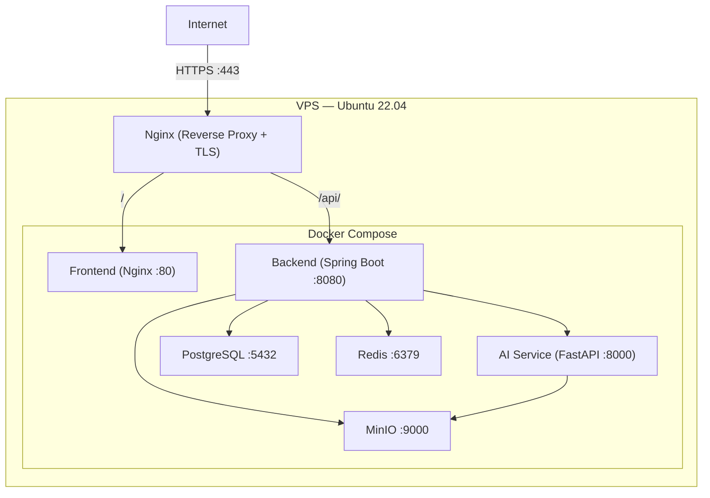

# PhysiqO-AI — Deployment Architecture

> **Version:** 1.0.0 · **Status:** Design Phase

---

## 1. Local Development

### Prerequisites

- Docker Desktop (with Docker Compose)
- Node.js 20+ (for frontend dev server)
- Java 21 (for backend — or run in Docker)
- Python 3.12+ (for AI service — or run in Docker)

### Docker Compose Services

> **Local-dev host port note:** PostgreSQL publishes to host port **5433** in the
> checked-in `docker-compose.yml` to avoid collisions with other local Postgres
> installs. The container-internal port is still 5432 (other Compose services
> connect via `postgres:5432`). Override with `POSTGRES_HOST_PORT`. See
> [ADR-0001](./ADR/ADR-0001-postgres-dev-host-port.md). The snippet below shows
> the original canonical mapping for reference.

```yaml
# docker-compose.yml
services:
  postgres:
    image: postgres:16-alpine
    ports: ["5432:5432"]
    environment:
      POSTGRES_DB: physiqo
      POSTGRES_USER: physiqo
      POSTGRES_PASSWORD: physiqo_dev
    volumes:
      - pgdata:/var/lib/postgresql/data
    healthcheck:
      test: ["CMD-SHELL", "pg_isready -U physiqo"]
      interval: 5s
      retries: 5

  redis:
    image: redis:7-alpine
    ports: ["6379:6379"]
    healthcheck:
      test: ["CMD", "redis-cli", "ping"]
      interval: 5s
      retries: 5

  minio:
    image: minio/minio:latest
    ports:
      - "9000:9000"   # S3 API
      - "9001:9001"   # Console
    environment:
      MINIO_ROOT_USER: physiqo
      MINIO_ROOT_PASSWORD: physiqo_dev
    command: server /data --console-address ":9001"
    volumes:
      - miniodata:/data

  backend:
    build:
      context: ./backend
      dockerfile: Dockerfile
    ports: ["8080:8080"]
    environment:
      SPRING_PROFILES_ACTIVE: dev
      SPRING_DATASOURCE_URL: jdbc:postgresql://postgres:5432/physiqo
      SPRING_DATASOURCE_USERNAME: physiqo
      SPRING_DATASOURCE_PASSWORD: physiqo_dev
      SPRING_DATA_REDIS_HOST: redis
      JWT_SECRET: dev-jwt-secret-change-in-production
      MINIO_ENDPOINT: http://minio:9000
      MINIO_ACCESS_KEY: physiqo
      MINIO_SECRET_KEY: physiqo_dev
      AI_SERVICE_URL: http://ai-service:8000
      AI_SERVICE_KEY: dev-service-key
    depends_on:
      postgres: { condition: service_healthy }
      redis: { condition: service_healthy }

  ai-service:
    build:
      context: ./ai-service
      dockerfile: Dockerfile
    ports: ["8000:8000"]
    environment:
      AI_PROVIDER: openai
      OPENAI_API_KEY: ${OPENAI_API_KEY}
      MINIO_ENDPOINT: minio:9000
      MINIO_ACCESS_KEY: physiqo
      MINIO_SECRET_KEY: physiqo_dev
      SERVICE_API_KEY: dev-service-key
    depends_on: [minio]

volumes:
  pgdata:
  miniodata:
```

### Development Workflow

```
# Terminal 1: Infrastructure
docker compose up postgres redis minio

# Terminal 2: Backend (hot reload with Spring DevTools)
cd backend && ./mvnw spring-boot:run -Dspring-boot.run.profiles=dev

# Terminal 3: AI Service (hot reload with uvicorn)
cd ai-service && uvicorn app.main:app --reload --port 8000

# Terminal 4: Frontend (Vite dev server)
cd frontend && npm run dev
```

**Or full Docker setup:**

```
docker compose up --build
```

---

## 2. Dockerfiles

### Backend Dockerfile

```dockerfile
FROM eclipse-temurin:21-jdk-alpine AS build
WORKDIR /app
COPY pom.xml .
COPY .mvn .mvn
COPY mvnw .
RUN chmod +x mvnw && ./mvnw dependency:go-offline
COPY src src
RUN ./mvnw package -DskipTests

FROM eclipse-temurin:21-jre-alpine
WORKDIR /app
COPY --from=build /app/target/*.jar app.jar
EXPOSE 8080
HEALTHCHECK --interval=30s --timeout=3s \
  CMD wget -qO- http://localhost:8080/actuator/health || exit 1
ENTRYPOINT ["java", "-jar", "app.jar"]
```

### AI Service Dockerfile

```dockerfile
FROM python:3.12-slim
WORKDIR /app
RUN apt-get update && apt-get install -y --no-install-recommends \
    libgl1-mesa-glx libglib2.0-0 && rm -rf /var/lib/apt/lists/*
COPY requirements.txt .
RUN pip install --no-cache-dir -r requirements.txt
COPY app app
EXPOSE 8000
HEALTHCHECK --interval=30s --timeout=3s \
  CMD python -c "import urllib.request; urllib.request.urlopen('http://localhost:8000/api/v1/health')" || exit 1
CMD ["uvicorn", "app.main:app", "--host", "0.0.0.0", "--port", "8000"]
```

### Frontend Dockerfile (Production)

```dockerfile
FROM node:20-alpine AS build
WORKDIR /app
COPY package*.json .
RUN npm ci
COPY . .
RUN npm run build

FROM nginx:alpine
COPY --from=build /app/dist /usr/share/nginx/html
COPY nginx.conf /etc/nginx/conf.d/default.conf
EXPOSE 80
```

---

## 3. Production Deployment

### Target: Single VPS (MVP)

For MVP, deploy to a single VPS (e.g., Hetzner, DigitalOcean, AWS EC2):



### Nginx Reverse Proxy

```nginx
server {
    listen 443 ssl http2;
    server_name physiqo.app;

    ssl_certificate /etc/letsencrypt/live/physiqo.app/fullchain.pem;
    ssl_certificate_key /etc/letsencrypt/live/physiqo.app/privkey.pem;

    # Frontend SPA
    location / {
        proxy_pass http://localhost:3000;
    }

    # Backend API
    location /api/ {
        proxy_pass http://localhost:8080;
        proxy_set_header Host $host;
        proxy_set_header X-Real-IP $remote_addr;
        proxy_set_header X-Forwarded-For $proxy_add_x_forwarded_for;
        proxy_set_header X-Forwarded-Proto $scheme;
        client_max_body_size 10M;
    }
}
```

---

## 4. Environment Configuration

### Production Environment Variables

```env
# Database
DB_USER=physiqo_prod
DB_PASSWORD=<strong-random-password>
SPRING_DATASOURCE_URL=jdbc:postgresql://postgres:5432/physiqo

# Security
JWT_SECRET=<64-char-random-string>
AI_SERVICE_KEY=<random-service-key>

# MinIO
MINIO_ACCESS_KEY=<access-key>
MINIO_SECRET_KEY=<secret-key>

# AI
OPENAI_API_KEY=sk-...
AI_PROVIDER=openai

# App
SPRING_PROFILES_ACTIVE=prod
```

### Secrets Management (MVP)

- `.env` file on VPS, not in version control
- `.env.example` committed with placeholder values
- Future: Docker Secrets or HashiCorp Vault

---

## 5. Database Backup

```bash
# Automated daily backup via cron
0 2 * * * docker exec postgres pg_dump -U physiqo_prod physiqo | gzip > /backups/physiqo_$(date +\%Y\%m\%d).sql.gz

# Retain last 30 days
find /backups -name "*.sql.gz" -mtime +30 -delete
```

---

## 6. Monitoring (MVP)

| Component | Tool | Purpose |
|---|---|---|
| Spring Boot | Actuator `/actuator/health` | Health checks |
| Python AI | `/api/v1/health` | Health checks |
| Docker | `docker compose ps` | Service status |
| Logs | Docker logs → file | `docker compose logs -f` |
| Uptime | UptimeRobot (free) | External monitoring |

### Health Check Endpoints

- `GET /actuator/health` → Spring Boot health
- `GET /api/v1/health` → AI service health
- Docker Compose healthchecks for PostgreSQL, Redis

---

## 7. CI/CD (Future)


**MVP approach:** Manual deployment via SSH + `docker compose up -d --build`. CI/CD pipeline added in Phase 2.
